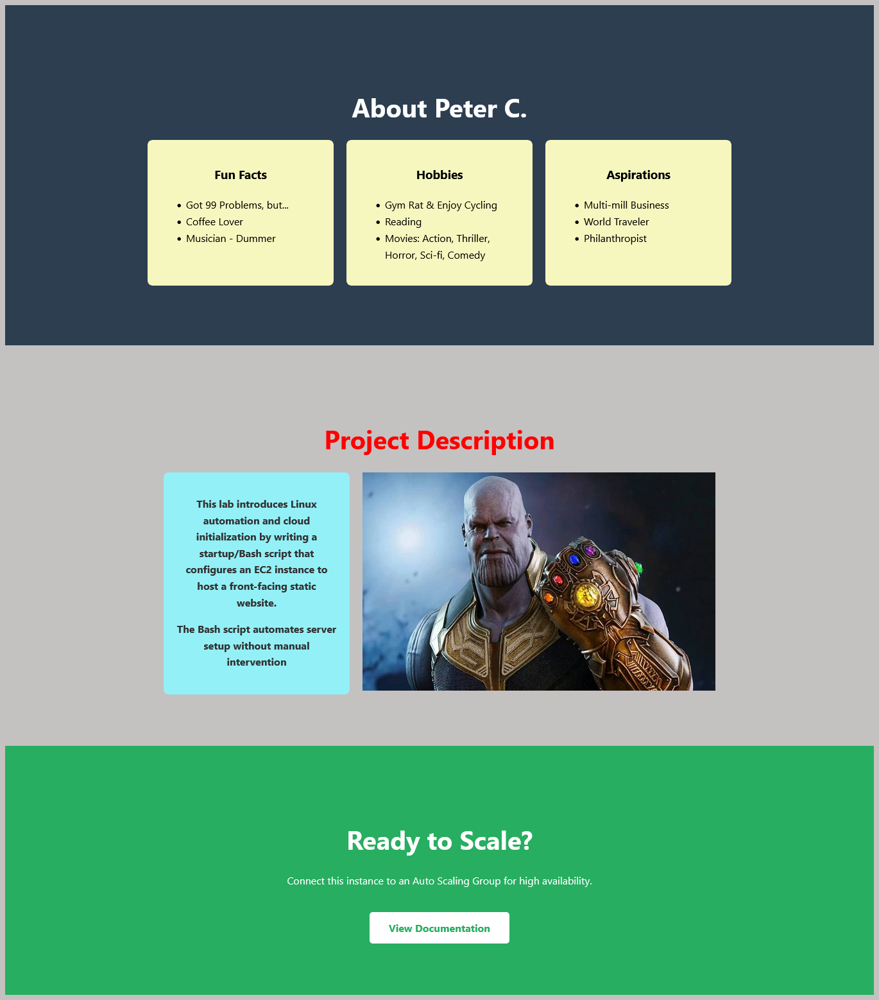
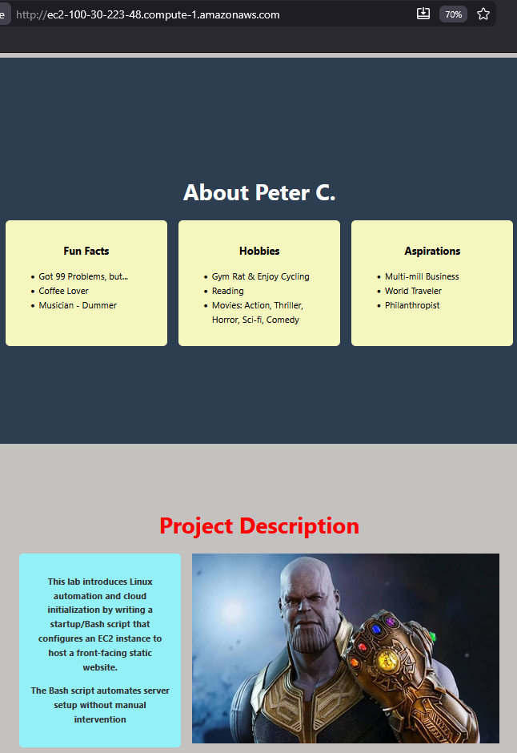

# SingleA LAB2

This lab introduces Linux automation and cloud initialization by writing a startup script that configures an EC2 instance to host a front-facing static website. Bash scripting was used to automate server setup without manual intervention.

Below are snapshots validating successful completion of the lab.

---

# EC2 Instance Resource Settings (after creation)

---

# EC2 Security Group (SG)
")

---

# EC2 Hosted Website

---

# EC2 Hosted Website w/ Instance Public DNS

